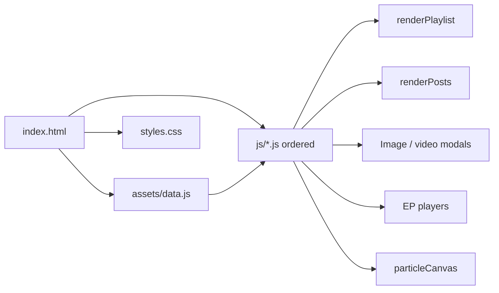

<!-- PRESERVATION RULE: Never delete or replace content. Append or annotate only. -->

# Nate's Space - Architecture

## Overview
Nate's Space is a static personal portfolio/social-style website built with vanilla HTML, CSS, and JavaScript. No frameworks, no build step - just push to GitHub Pages and it works.

## Project Structure

```
NatesSpace/
├── index.html          # Feed shell; modals; EP player DOM; composer
├── music.html          # Full music library (all `musicCatalog` tracks + dedicated player)
├── styles.css          # Themes, glass UI, responsive, animations
├── js/                 # Runtime modules (loaded in order; see “JavaScript modules” below)
├── .nojekyll           # Prevents Jekyll processing on GitHub Pages
├── .gitignore          # Ignores node_modules, *.wav, *.exe, etc.
├── assets/
│   ├── data.js         # NatesData: `musicCatalog`, gallery `images`, `posts`; `getEpTracks()`
│   ├── *.jpg, *.mp4    # Media (paths referenced from HTML/data.js)
│   └── music/          # All tracks (mp3/m4a/…); listed in `musicCatalog`
├── tools/
│   ├── convert.js      # (Dev) CommonJS HEIC → JPG using heic-convert
│   ├── convert.mjs     # (Dev) ESM variant
│   ├── convert_audio.bat # (Dev) WAV → M4A helper for local encoding
│   └── scan-music.mjs  # (Dev) Print JSON stubs for files in assets/music/
├── README.md
└── DOCS/
    ├── ARCHITECTURE.md
    ├── CHANGELOG.md
    ├── SBOM.md
    ├── SCRATCHPAD.md
    ├── SUMMARY.md
    ├── STYLE_GUIDE.md
    └── My_Thoughts.md
```

## Design System

### Color Palette
| Variable | Dark Mode | Light Mode |
|----------|-----------|------------|
| `--bg-primary` | `#0a0a0f` | `#f5f7fa` |
| `--bg-glass` | `rgba(15,15,20,0.7)` | `rgba(255,255,255,0.8)` |
| `--accent-color` | `#00d4aa` (teal) | same |
| `--accent-secondary` | `#00a8cc` (cyan) | same |
| `--accent-tertiary` | `#7b61ff` (purple) | same |

### Typography
- **Headings/Body**: Outfit (Google Fonts)
- **Logo/Mono**: Space Mono (Google Fonts)

### Components
1. **Particle layer** - `#particleCanvas` sits behind `.app-layout`; `js/particles.js` fills it with drifting accent-colored dots and resizes with the window.
2. **Glass Panel** - Frosted glass effect with blur, used for all containers.
3. **Profile Card/Hero** - Desktop uses a sidebar card; Mobile uses a top hero section with background image.
4. **Gallery Grid** - Interactive image grid with lightbox triggers; metadata from `NatesData.images`.
5. **Friends Grid (Creative Circle)** - Bubble-style avatars with hover effects.
6. **Post Card** - Multi-type posts (Photo, Video, Update) built by `renderPosts()` from `NatesData.posts`.
7. **Image Lightbox (Facebook-style)**:
   - Shared modal for all images.
   - Desktop: Two-column split (Image / Social Data).
   - Mobile: Vertical stack (Image / Bottom Sheet metadata).
   - Touch: horizontal swipe navigates prev/next image.
8. **Music Player**:
   - Desktop: Sidebar mini-player + Apple Music Modal.
   - Mobile: Persistent bottom bar (Spotify-style) with expanded tracklist view.
9. **Toast stack** - `#toastContainer` for Save/Share feedback.

### Layout & Logic
- **Layout Toggles**: Desktop supports swapping sidebars or entering "Focus" mode (centered feed).
- **Responsive Logic**: Media queries handle the transition from a 2-column desktop layout to a 1-column mobile stack. Mobile hides the layout toggle as it's not applicable.
- **Cache Busting**: Manual query string on `styles.css` and each `js/*.js` in `index.html` / `music.html` (currently `?v=112`) so updates beat CDN/browser caches.
- **Feed pipeline**: `index.html` loads `assets/data.js` (defines `NatesData`), then `js/app-init.js` calls `renderPlaylist()` and `renderPosts()`. Static `article.post` nodes are no longer shipped; the feed is entirely data-driven when `NatesData` is present.

### JavaScript modules (`js/`) — load order [added 2026-03-20]

| File | Role |
|------|------|
| `overlay-utils.js` | `lockBodyScroll` / `unlockBodyScroll` (ref-counted) for modals |
| `toast.js` | `showToast` (DOM-safe) |
| `theme-layout.js` | Theme + layout toggles, hero / focus player visibility |
| `particles.js` | `#particleCanvas` animation |
| `scroll-reveal.js` | `window.revealObserver` + initial observe on gallery/friends |
| `playlist.js` | `renderPlaylist()` — EP rows from `NatesData.getEpTracks()` (`musicCatalog` + `includeOnEp`) |
| `music-page.js` | `music.html` only: library list + `#libraryAudio` dock player |
| `audio.js` | Shared `<audio id="audioPlayer">`, `playTrack`, progress sync, mobile + focus chrome |
| `modals.js` | Follow modal + Apple Music modal |
| `lightbox.js` | Image lightbox (delegated clicks), video modal, swipe, keyboard |
| `posts.js` | `renderPosts()` — DOM `createElement` feed from `NatesData.posts` |
| `app-init.js` | Boot: playlist → posts → delegated `.action-btn` pulse + Save/Share |
- **Scroll reveal**: `IntersectionObserver` adds `.visible` to `.scroll-reveal` elements (posts, gallery, friends); new posts get `.scroll-reveal` when rendered.

### Runtime diagram (high level)



## Deployment
1. Push to GitHub.
2. Enable GitHub Pages (main branch, root folder).
3. Site live at `https://[username].github.io/NatesSpace/`.

No build required. Just `git push`.
